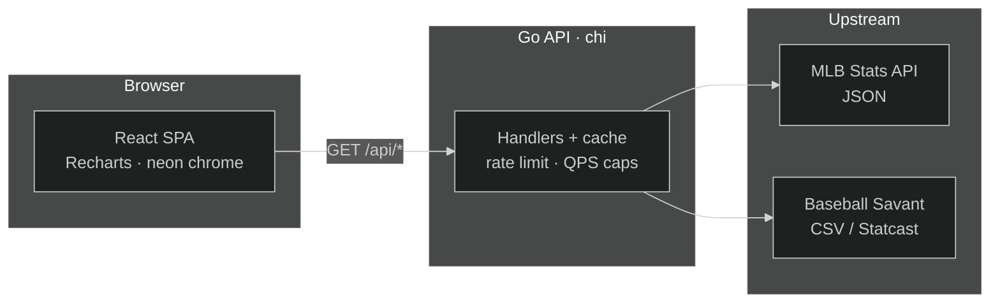
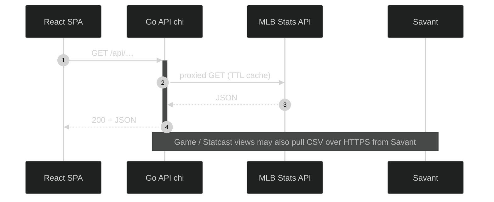
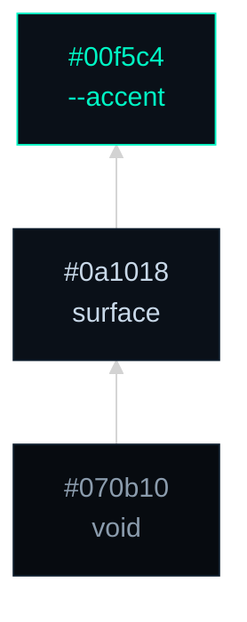
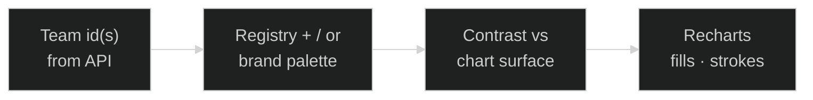

# Caught looking

[](https://github.com/danibsheehan/caught-looking/actions/workflows/ci.yml)
[](https://docs.caught-looking.com/)
[](https://caught-looking.com/standings)
[](https://go.dev/)
[](https://react.dev/)
[](https://www.typescriptlang.org/)
[](https://vitejs.dev/)


[](https://caught-looking.com/standings)

> League tables, spray geometry, and Statcast-backed panels—**built for a dark dugout**, not a bright dashboard template.

**Neon on obsidian** — near-black fields (`#070b10`, `#0a1018`), **teal** (`--accent`, `#00f5c4`) for links, focus, and primary chart chrome, cool gray body type for readable contrast. Multi-series charts cycle **teal, violet, and pink-tinted companion** hex seeds via [`frontend/src/utils/neonChartPalette.ts`](frontend/src/utils/neonChartPalette.ts) (not extra `html` CSS variables). **DM Sans** carries prose; **Space Mono** carries numerals and axes so stats scan like telemetry, not wallpaper.

Web app for exploring **MLB statistics** with charts and comparisons. The UI talks to a small **Go** backend that proxies and caches requests to the public **MLB Stats API** (`statsapi.mlb.com`) and, for some game views, **Baseball Savant** (Statcast CSV over HTTPS).

| ◆ | What stands out |
| :---: | :--- |
| **Contract** | Handlers and the SPA share one **OpenAPI** spec → generated TypeScript types + Redoc. |
| **Color** | **Shell** tokens in SCSS; **team ink** from registry + MLB brand picks, contrast-adjusted per chart surface. |
| **Ops** | Per-IP limits, outbound **QPS caps**, and TTL caches so public upstreams stay friendly at scale. |

> [!TIP]
> Ship shape in one command: **`make install`** then **`make dev`** — API on **`:8080`**, Vite on **`:5173`**, browser hits **`/api`** through the proxy.

> [!NOTE]
> **Live app:** [caught-looking.com/standings](https://caught-looking.com/standings) · [www.caught-looking.com/standings](https://www.caught-looking.com/standings) · **API reference (Redoc):** [docs.caught-looking.com](https://docs.caught-looking.com/)

**Jump:** [Overview](#overview) · [Architecture](#architecture) · [Design tokens](#design-tokens) · [Features](#features) · [Tech stack](#tech-stack) · [Project layout](#project-layout) · [Prerequisites](#prerequisites) · [Editor setup](#editor-setup) · [Run locally](#run-locally) · [Configuration](#configuration) · [Deployment (CI)](#deployment-ci) · [Contributing](#contributing)

---

## Overview

**Production:** [caught-looking.com/standings](https://caught-looking.com/standings) or [www.caught-looking.com/standings](https://www.caught-looking.com/standings) — same SPA (Cloudflare Pages + Cloud Run API — see [Deployment (CI)](#deployment-ci)).

**Standings → Teams → Players → Games** — from league table to slate to **per-game** detail (timeline, boxscore-style views, Statcast-backed panels where data exists). **OpenAPI / Redoc**: [https://docs.caught-looking.com/](https://docs.caught-looking.com/)

SPA routes: `/standings`, `/teams`, `/players`, `/games`, `/games/:gamePk` (default landing: `/standings`). Routing: [`frontend/src/App.tsx`](frontend/src/App.tsx).

---

## Architecture

Browser **React** app calls same-origin **`/api`** (Vite proxy in dev, `VITE_API_BASE` in prod). **Go** applies cache TTLs, per-IP limits, and outbound QPS caps before fanning out to **MLB** JSON and **Savant** CSV.



### Request path (happy path)

Typical **read** from the SPA: JSON in, JSON out; the Go layer adds cache keys, rate limits, and upstream timeouts.



**App chrome (CSS)** — the global shell is fixed: obsidian base below, surface and teal **`--accent`** above (bottom → top). This stack does **not** include chart series colors.

_Arrows = stacking narrative for the shell only, not layout or data flow._



**Chart data ink (dynamic)** — team-branded bars, lines, and stacks use colors **keyed by team id** from the API, not the three-node shell stack above. [`mlbTeamObsidianRegistry.ts`](frontend/src/utils/mlbTeamObsidianRegistry.ts) supplies obsidian-tuned ink/label pairs; [`mlbTeamColors.ts`](frontend/src/utils/mlbTeamColors.ts) resolves MLB primaries/secondaries, comparison fallbacks, and distinctness when many clubs share a chart. Everything is nudged for contrast vs the plot surface via [`chartColorContrast.ts`](frontend/src/utils/chartColorContrast.ts). Charts **without** team branding (generic multi-series) cycle [`neonChartPalette.ts`](frontend/src/utils/neonChartPalette.ts) instead.



---

## Design tokens

Defined on `html` in [`frontend/src/styles/_base.scss`](frontend/src/styles/_base.scss). Update these tables when values change.

**Typography** — `--sans`, `--heading`, and `--mono` are font stacks (DM Sans for UI and headings, Space Mono for numerals/ticks); see the file for full fallbacks.

### Colors & surfaces

| CSS variable | Hex / value | Role                        |
| :----------- | :---------- | :-------------------------- |
| `--bg`       | `#070b10`   | Deepest background          |
| `--surface`  | `#0a1018`   | Panels and cards            |
| `--text`     | `#8b9cad`   | Body (AA vs `--bg`)         |
| `--text-h`   | `#c8d8e8`   | Headings, `code` foreground |
| `--muted`    | `#5a6b7c`   | Secondary labels            |
| `--border`   | `#0f1e2d`   | Shell edges, dividers       |
| `--code-bg`  | `#0d121a`   | Inline `code` background    |

### Charts

| CSS variable         | Hex / value | Role                               |
| :------------------- | :---------- | :--------------------------------- |
| `--chart-tick`       | `#4a5f72`   | Default axis tick color            |
| `--chart-grid-faint` | `#0d1a26`   | Faint grid lines                   |
| `--chart-y-mid`      | `#0f2030`   | Reference band (e.g. 50% win line) |
| `--chart-y-mid-tick` | `#1a3a30`   | Tick on that reference             |

### Accent & depth

| CSS variable      | Hex / value            | Role                                                     |
| :---------------- | :--------------------- | :------------------------------------------------------- |
| `--accent`        | `#00f5c4`              | Teal neon — links, active chrome, primary chart emphasis |
| `--accent-bg`     | `rgba(0,245,196,0.08)` | Soft teal wash on surfaces                               |
| `--accent-border` | `rgba(0,245,196,0.45)` | Focus / selected borders                                 |
| `--shadow`        | layered `rgba` blacks  | Panel depth (see file)                                   |

---

## Features

| Area          | What you get                                                                                       |
| :------------ | :------------------------------------------------------------------------------------------------- |
| **Standings** | League standings for the configured season.                                                        |
| **Teams**     | Team overview with season stats and record timelines.                                              |
| **Players**   | Side-by-side comparison (radar, trends, game log); hitting / pitching views.                       |
| **Games**     | Date slate + **per-game** detail (timeline, boxscore-style views, Statcast panels when available). |
| **Docs**      | [OpenAPI/Redoc](https://docs.caught-looking.com/) from `backend/apidocs/openapi.yaml`.             |

---

## Tech stack

| Layer    | Technology                                                                                                                                         |
| -------- | -------------------------------------------------------------------------------------------------------------------------------------------------- |
| Frontend | React 19, TypeScript, Vite, React Router, Recharts, ESLint, Prettier                                                                               |
| Backend  | Go 1.26, [chi](https://github.com/go-chi/chi) router, TTL cache, per-IP HTTP rate limit, token-bucket QPS caps for MLB and Savant outbound traffic |
| Data     | MLB Stats API v1 (JSON); Baseball Savant (CSV) for Statcast-oriented game data                                                                     |

<details>
<summary><strong>CI & quality gates</strong> (expand)</summary>

Continuous integration runs in **GitHub Actions** on **every branch push** and on **pull requests**: **frontend** — OpenAPI lint (`api:validate`), generated-type drift check (`api:types:check`), ESLint, Prettier (`format:check`), TypeScript, **`npm audit`** (high+), **Vitest with V8 coverage**, production build; **backend** — `go vet`, **`govulncheck`**, **`go test` with coverage** (Cobertura XML via `gocover-cobertura`), `go build`. On pull requests from the same repository, [**PR guide**](.github/workflows/pr-guide.yml) scaffolds an empty or default PR description (suggested verify commands, **Touches** metadata), posts or updates a sticky comment (checklist hints, reviewer focus), and applies **`area:*`** labels from changed paths; separate read/write-scoped jobs add or update **two** coverage comments (frontend and backend); [**Pages preview**](.github/workflows/pages-preview.yml) builds the SPA with **`VITE_API_BASE`** and publishes a Cloudflare branch preview; [**preview cleanup**](.github/workflows/pages-preview-cleanup.yml) deletes those deployments when the PR is closed or merged. Fork PRs may not receive guide, coverage comments, or previews due to `GITHUB_TOKEN` / secrets limits (those steps are non-blocking or skipped). Pushes to **`main`** can also run **Deploy** (Cloud Run API + Cloudflare Pages frontend) when repository variables and secrets are set; see **Deployment (CI)**.

**Dependabot** ([`.github/dependabot.yml`](.github/dependabot.yml)) opens weekly version-update PRs for **Go modules** (`backend/`), **npm** (`frontend/`), and **GitHub Actions**. Review those PRs like any other change — CI (including `govulncheck` and `npm audit`) still gates merges. Separately, enable **Dependabot alerts** and **Dependabot security updates** in the repo’s GitHub **Settings → Code security** so known advisories can open fix PRs outside the weekly cadence.

</details>

---

## Project layout

| Concern        | Path                                                                                                                   |
| :------------- | :--------------------------------------------------------------------------------------------------------------------- |
| Shell / routes | [`frontend/src/App.tsx`](frontend/src/App.tsx), [`frontend/src/styles/_shell.scss`](frontend/src/styles/_shell.scss)   |
| Global theme   | [`frontend/src/styles/_base.scss`](frontend/src/styles/_base.scss); feature SCSS under `frontend/src/styles/features/`; README art in [`docs/readme-banner.svg`](docs/readme-banner.svg), [`docs/badge-live.svg`](docs/badge-live.svg) (minimal SVGs; paths are `./docs/…` from README root) |
| Pages          | `frontend/src/pages/`                                                                                                  |
| API client     | [`frontend/src/api/client.ts`](frontend/src/api/client.ts) — `VITE_API_BASE` or `/api` in dev                          |
| Types          | `frontend/src/types/api.generated.ts`, `frontend/src/types/api.compat.ts`                                              |
| Backend        | `backend/` — chi, MLB + Savant clients, `backend/apidocs/openapi.yaml`                                                 |

---

## Prerequisites

- **Go** 1.26+
- **Node.js** 22+ and **npm** (CI uses Node 22; newer LTS generally works)

---

## Editor setup

The repo ships [`.vscode/settings.json`](.vscode/settings.json) so **VS Code** and **Cursor** format `frontend/` files on save with **Prettier** (`frontend/prettier.config.js`). Install the recommended [**Prettier**](https://marketplace.visualstudio.com/items?itemName=esbenp.prettier-vscode) extension when prompted (see [`.vscode/extensions.json`](.vscode/extensions.json)). Accept workspace settings if the editor asks.

| What | Where |
| :--- | :--- |
| Format on save | `.vscode/settings.json` — Prettier for TS/TSX/JS/JSON/SCSS/HTML under `frontend/` |
| Prettier config | `frontend/prettier.config.js` |
| Cursor agents | [`.cursor/rules/frontend-prettier.mdc`](.cursor/rules/frontend-prettier.mdc) — run `npx prettier --write` on changed files before finishing |

CI still runs `npm run format:check`; format on save and agent rules reduce drift before push.

---

## Run locally

From the **repository root**:

```bash
make install   # once: Go modules + frontend npm dependencies
make dev       # API on :8080 + Vite dev server (with /api proxy)
```

- **API**: [http://127.0.0.1:8080](http://127.0.0.1:8080) — `GET /health` returns `ok`.
- **Frontend**: Vite (typically [http://localhost:5173](http://localhost:5173)) proxies `/api` to the backend so the browser uses same-origin `/api` in development.

Run services separately if you prefer:

```bash
make backend    # Go API only
make frontend   # Vite only (expects API on 127.0.0.1:8080 for `/api`)
```

### Frontend scripts (`frontend/`)

| Command                   | Purpose                                                                |
| ------------------------- | ---------------------------------------------------------------------- |
| `npm run dev`             | Dev server                                                             |
| `npm run build`           | Production bundle                                                      |
| `npm run preview`         | Preview production build                                               |
| `npm run lint`            | ESLint                                                                 |
| `npm audit --audit-level=high` | Fail on high/critical advisories (CI)                            |
| `npm run format`          | Prettier — write (`src/types/api.generated.ts` is ignored; run `api:types` separately) |
| `npm run format:check`    | Prettier — check only (CI)                                            |
| `npm run typecheck`       | TypeScript `--noEmit`                                                  |
| `npm run api:validate`    | Lint OpenAPI (`backend/apidocs/openapi.yaml`)                          |
| `npm run api:types`       | Generate `src/types/api.generated.ts` from OpenAPI                     |
| `npm run api:types:check` | Regenerate + fail if `api.generated.ts` is stale                       |
| `npm run test`            | Vitest (watch mode)                                                    |
| `npm run test:run`        | Vitest once (matches CI)                                               |
| `npm run test:coverage`   | Vitest once with V8 coverage (`frontend/coverage/`, open `index.html`) |

Tests use **Vitest** (jsdom), **Testing Library**, and **`@testing-library/jest-dom`** matchers (`frontend/src/test/setup.ts`). Prefer mocking **`frontend/src/api/client`** in unit tests rather than calling the real API.

### OpenAPI workflow

- Source of truth: `backend/apidocs/openapi.yaml`
- Deployed docs (Redoc): [https://docs.caught-looking.com/](https://docs.caught-looking.com/)
- Validate spec: `cd frontend && npm run api:validate`
- Regenerate types: `cd frontend && npm run api:types`
- App-facing type surface: `frontend/src/types/api.compat.ts` (backed by generated `frontend/src/types/api.generated.ts`)
- GitHub Pages deploy: `.github/workflows/openapi-pages.yml` publishes a static Redoc site from `main` when `backend/apidocs/openapi.yaml` changes.

### Tests from the repo root (`Makefile`)

| Target                    | Purpose                                                        |
| ------------------------- | -------------------------------------------------------------- |
| `make check-openapi`      | Lint OpenAPI + verify generated frontend API types are current |
| `make test-backend`       | Backend CI checks: `go vet`, `govulncheck`, tests, build       |
| `make test-frontend`      | `npm run test:run` in `frontend/`                              |
| `make cover-backend`      | Go coverage summary (`backend/coverage.out`)                   |
| `make cover-backend-html` | Same + `backend/coverage.html`                                 |
| `make cover-frontend`     | Vitest coverage report under `frontend/coverage/`              |

Backend tests live as `*_test.go` next to packages under `backend/`. Frontend tests are colocated as `*.test.ts` / `*.test.tsx` next to sources. Conventions for agents and contributors are summarized in **`.cursor/skills/backend-go-tests/SKILL.md`** (Go) and **`.cursor/skills/frontend-vitest-tests/SKILL.md`** (frontend).

---

## Configuration

### Backend (environment variables)

| Variable              | Purpose                                                                                                                      |
| --------------------- | ---------------------------------------------------------------------------------------------------------------------------- |
| `PORT` or `HTTP_ADDR` | Listen address (default `:8080`; `PORT` is prefixed with `:` if set)                                                         |
| `MLB_BASE_URL`        | MLB Stats API base (default `https://statsapi.mlb.com/api/v1`)                                                               |
| `SAVANT_BASE_URL`     | Baseball Savant base URL (default `https://baseballsavant.mlb.com`; trailing slashes stripped)                               |
| `ALLOWED_ORIGINS`     | Comma-separated CORS origins (defaults include Vite on `5173`)                                                               |
| `MLB_SEASON`          | Default season integer (e.g. `2026`)                                                                                         |
| `MLB_LEAGUE_IDS`      | Default league ids for standings (default `103,104`)                                                                         |
| `CACHE_TTL_STANDINGS` | Standings cache TTL (Go duration, e.g. `1h`; default `1h`)                                                                   |
| `CACHE_TTL_SCORES`    | Scores-related cache TTL (default `5m`)                                                                                      |
| `CACHE_TTL_STATCAST`  | Statcast / Savant CSV cache TTL per game (default `6h`)                                                                      |
| `CACHE_TTL_PLAYER_SEARCH` | Player-search cache TTL for name query keys (default `3m`)                                                              |
| `CACHE_SWEEP_INTERVAL` | Interval for removing expired entries and applying `CACHE_MAX_ENTRIES` (default `2m`; `0` disables background sweeps)        |
| `CACHE_MAX_ENTRIES`   | Max in-memory cache entries before sweeps evict back to ~90% of the cap (default `2000`; `0` = unlimited)                    |
| `RATE_LIMIT_REQUESTS` | Max requests per client IP per sliding window (default `120`; set `0` to disable)                                            |
| `RATE_LIMIT_WINDOW`   | Sliding window for that limit (default `1m`)                                                                                 |
| `MLB_MAX_QPS`         | Max outbound GETs per second to the MLB API **per process** (token bucket, default `20`; `0` = unlimited)                    |
| `MLB_HTTP_TIMEOUT`    | Per-attempt timeout for outbound MLB GETs (Go duration; default `15s`; `0s` or negative values use the client default `15s`) |
| `SAVANT_MAX_QPS`      | Max outbound GETs per second to Savant **per process** (token bucket, default `5`; `0` = unlimited)                          |

### Frontend (Vite)

| Variable        | Purpose                                                                                                                                                                         |
| --------------- | ------------------------------------------------------------------------------------------------------------------------------------------------------------------------------- |
| `VITE_API_BASE` | API base URL **without** trailing slash. In dev, omit it to use `/api` + the Vite proxy. Production builds served at [caught-looking.com](https://caught-looking.com/standings) or [www.caught-looking.com](https://www.caught-looking.com/standings) set this to the deployed Cloud Run API URL. |

---

## Deployment (CI)

Pushes to **`main`** (and manual **Run workflow** via `workflow_dispatch`) run [`.github/workflows/deploy.yml`](.github/workflows/deploy.yml): build and push the API container to **Artifact Registry**, deploy to **Cloud Run**, then build the SPA with **`VITE_API_BASE`** set to the deployed service URL and publish **`frontend/dist`** to **Cloudflare Pages** (via [`cloudflare/pages-action`](https://github.com/cloudflare/pages-action)). Pull requests from this repository run [`.github/workflows/pages-preview.yml`](.github/workflows/pages-preview.yml): the same SPA build with **`VITE_API_BASE`** pointed at the live Cloud Run API (from **`API_PUBLIC_URL`**, or looked up via `gcloud`), published as a **branch preview** (`https://<branch>.<project>.pages.dev`). When the PR is closed or merged, [`.github/workflows/pages-preview-cleanup.yml`](.github/workflows/pages-preview-cleanup.yml) deletes that branch’s preview deployments (Cloudflare keeps them indefinitely otherwise). Without **`VITE_API_BASE`**, the client falls back to same-origin **`/api`**, Pages serves `index.html`, and the UI shows a JSON parse error. Forks skip deploy jobs.

Prefer **Direct Upload** from Actions for this project (empty Pages project is fine). If the Pages project is also connected to Git with its own build, either disable that build or set **`VITE_API_BASE`** in the Cloudflare Pages **Preview** environment to the Cloud Run origin so native builds do not overwrite Actions previews with a broken bundle.

**One-time Google Cloud setup (example)**

- Enable billing, **Cloud Run**, **Artifact Registry**, and **Cloud Build** (optional; not required for this workflow’s Docker build in Actions).
- Create a **Docker** Artifact Registry repository (e.g. name matching `GCP_ARTIFACT_REPOSITORY`).
- Create a **deploy service account** for GitHub with at least: **Artifact Registry Writer**, **Cloud Run Admin**, and **Service Account User** (on the project’s Cloud Run runtime service account if prompted). Do **not** create a JSON key for CI.
- Configure **Workload Identity Federation** for this GitHub repository and allow the deploy service account to be impersonated by the repository’s GitHub Actions principal. Store the provider resource name in **`GCP_WORKLOAD_IDENTITY_PROVIDER`** and the service account email in **`GCP_DEPLOY_SERVICE_ACCOUNT`**.

**One-time Cloudflare setup**

- Create a **Pages** project (name must match **`CLOUDFLARE_PAGES_PROJECT_NAME`**). The project can be empty; Actions uploads the build output.
- Create a least-privilege **API token** with **Account → Cloudflare Pages → Edit** (and **Account → Read** if required by your account), rotate it periodically, and store **`CLOUDFLARE_API_TOKEN`** and **`CLOUDFLARE_ACCOUNT_ID`** as repository secrets.

**GitHub repository variables**

| Variable                        | Example                          | Purpose                                                                                        |
| ------------------------------- | -------------------------------- | ---------------------------------------------------------------------------------------------- |
| `GCP_PROJECT_ID`                | `my-gcp-project`                 | GCP project id                                                                                 |
| `GCP_REGION`                    | `us-central1`                    | Cloud Run and Artifact Registry region                                                         |
| `GCP_ARTIFACT_REPOSITORY`       | `caught-looking`                 | Artifact Registry repo name (image: `…/api:<git-sha>`)                                         |
| `CLOUDRUN_SERVICE_NAME`         | `caught-looking-api`             | Cloud Run service name                                                                         |
| `GCP_WORKLOAD_IDENTITY_PROVIDER` | `projects/123/locations/global/workloadIdentityPools/github/providers/caught-looking` | Workload Identity Federation provider resource name for GitHub Actions |
| `GCP_DEPLOY_SERVICE_ACCOUNT`    | `gha-deploy@my-gcp-project.iam.gserviceaccount.com` | Deploy service account email impersonated by GitHub Actions                                    |
| `CORS_ALLOWED_ORIGINS`          | `https://caught-looking.com,https://www.caught-looking.com` | Comma-separated **`ALLOWED_ORIGINS`** for the API (apex + `www`). Deploy also appends `https://<project>.pages.dev` and `https://*.<project>.pages.dev` when **`CLOUDFLARE_PAGES_PROJECT_NAME`** is set. |
| `CLOUDFLARE_PAGES_PROJECT_NAME` | `your-project`                   | If **unset**, only the API deploy runs (useful while wiring Cloudflare).                       |
| `API_PUBLIC_URL`                | `https://….run.app`              | Optional. Cloud Run API origin (no trailing slash) for **PR preview** builds. If unset, the preview workflow looks the URL up with `gcloud`. |

**GitHub repository secrets**

| Secret                  | Purpose                      |
| ----------------------- | ---------------------------- |
| `CLOUDFLARE_API_TOKEN`  | Cloudflare API token         |
| `CLOUDFLARE_ACCOUNT_ID` | Cloudflare account id        |

After the first successful deploy, **`CORS_ALLOWED_ORIGINS`** must include the real SPA origins (this project: **`https://caught-looking.com`** and **`https://www.caught-looking.com`**). Pages project and branch-preview origins are added automatically from **`CLOUDFLARE_PAGES_PROJECT_NAME`**. If you add or change custom-domain origins, update the variable and push to **`main`** (or update the Cloud Run service env) so CORS matches the browser.

**Cost / abuse (optional, no extra GCP products)** — The API defaults to per-IP HTTP rate limiting and outbound QPS caps for MLB and Savant (see env vars above). On Cloud Run you can also set **maximum instances** (and concurrency) on the service to cap worst-case spend; defaults are in Google Cloud Console or `gcloud run services update … --max-instances=…`.

---

## Repository layout

```
backend/    # Go HTTP API, MLB + Savant clients, handlers, models
frontend/   # React SPA (src/, Vite, Vitest)
.vscode/    # Editor: format on save (Prettier), recommended extensions
Makefile    # install, dev, backend, frontend, test-*, cover-*
```

---

## Contributing

Use the [pull request template](.github/pull_request_template.md) for **Summary** and **How to verify**. The [**PR guide**](.github/workflows/pr-guide.yml) workflow scaffolds the description when it is empty or still the default template (suggested verify commands plus a **Touches** line) and posts a sticky comment with checklist hints and reviewer focus. Before opening a PR, run the same checks as CI (e.g. `make test-backend`, `make test-frontend`, plus `npm audit --audit-level=high` / `npm run api:validate` / `npm run api:types:check` / `npm run lint` / `npm run format:check` / `npm run typecheck` / `npm run build` in `frontend/`, and `go vet ./...`, `go run golang.org/x/vuln/cmd/govulncheck@latest ./...`, `go test ./...`, `go build` in `backend/`). Keep API changes in sync: **Go JSON / OpenAPI** ↔ generated frontend types (`frontend/src/types/api.generated.ts`) and `frontend/src/api/client.ts`.
