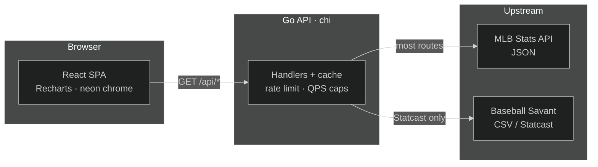
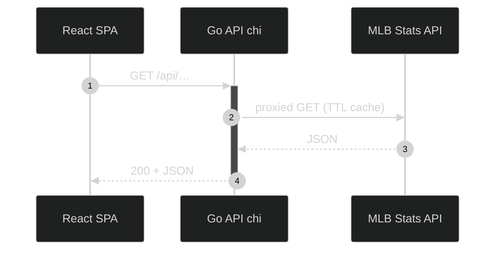
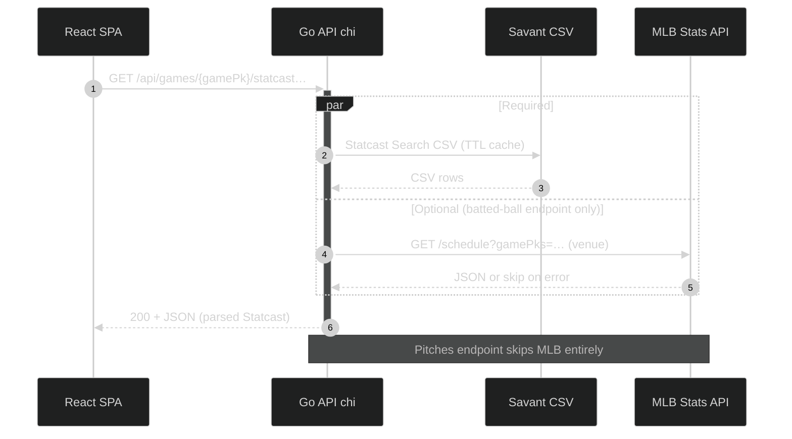
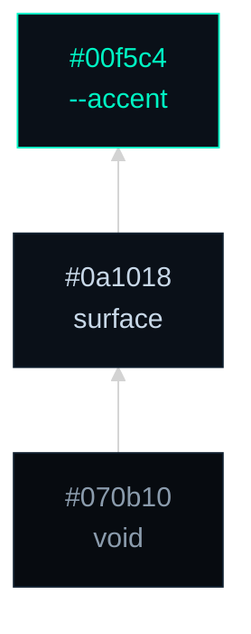
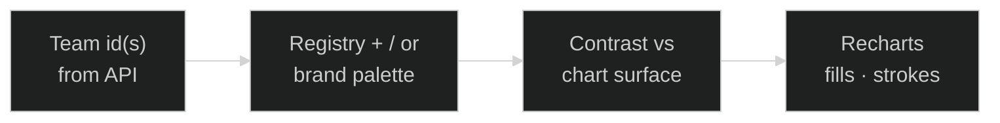

# Caught looking

[](https://github.com/danibsheehan/caught-looking/actions/workflows/ci.yml)
[](https://docs.caught-looking.com/)
[](https://caught-looking.com/standings)
[](https://go.dev/)
[](https://react.dev/)
[](https://www.typescriptlang.org/)
[](https://vitejs.dev/)


[](https://caught-looking.com/standings)

> League tables, spray geometry, and Statcast-backed panels—**built for a dark dugout**, not a bright dashboard template.

Web app for exploring **MLB statistics** with charts and comparisons. A **Go** backend proxies and caches the public **MLB Stats API** (`statsapi.mlb.com`) and, for some game views, **Baseball Savant** (Statcast CSV over HTTPS).

| ◆ | Theme |
| :---: | :--- |
| **Surfaces** | Near-black fields (`#070b10`, `#0a1018`) with cool gray body type |
| **Accent** | Teal `--accent` (`#00f5c4`) for links, focus, and primary chart chrome |
| **Type** | **DM Sans** for prose; **Space Mono** for numerals and axes |
| **Charts** | Team ink via registry + brand palette; [`neonChartPalette.ts`](frontend/src/utils/neonChartPalette.ts) is a non-team series helper (not extra `html` CSS variables) |

| ◆ | What stands out |
| :---: | :--- |
| **Contract** | Handlers and the SPA share one **OpenAPI** spec → generated TypeScript types + Redoc |
| **Color** | **Shell** tokens in SCSS; **team ink** from registry + MLB brand picks, contrast-adjusted per chart surface |
| **Ops** | Per-IP limits, outbound **QPS caps**, and TTL caches so public upstreams stay friendly at scale |

> [!TIP]
> Ship shape in one command: **`make install`** then **`make dev`** — API on **`:8080`**, Vite on **`:5173`**, browser hits **`/api`** through the proxy.

> [!NOTE]
> **Live app:** [caught-looking.com/standings](https://caught-looking.com/standings) · [www.caught-looking.com/standings](https://www.caught-looking.com/standings) · **API reference (Redoc):** [docs.caught-looking.com](https://docs.caught-looking.com/)

**Jump:** [Overview](#overview) · [Architecture](#architecture) · [Cost and scale](#cost-and-scale-tradeoffs) · [Design tokens](#design-tokens) · [Features](#features) · [Tech stack](#tech-stack) · [Project layout](#project-layout) · [Prerequisites](#prerequisites) · [Editor setup](#editor-setup) · [Run locally](#run-locally) · [Configuration](#configuration) · [Deployment (CI)](#deployment-ci) · [Contributing](#contributing) · [ADRs](docs/adr/) · [SLOs](docs/slo.md)

---

## Overview

| | |
| :--- | :--- |
| **Live app** | [caught-looking.com/standings](https://caught-looking.com/standings) · [www](https://www.caught-looking.com/standings) — Cloudflare Pages + Cloud Run ([Deployment](#deployment-ci)) |
| **API docs** | [docs.caught-looking.com](https://docs.caught-looking.com/) (OpenAPI / Redoc) |
| **Flow** | Standings → Leaders → Teams → Players → Games (slate + **per-game** timeline / boxscore / Statcast) |
| **Routes** | `/standings` (default), `/leaders`, `/teams`, `/players`, `/games`, `/games/:gamePk` — [`App.tsx`](frontend/src/App.tsx) |

---

## Architecture

| Layer | Role |
| :--- | :--- |
| **Browser** | React SPA → same-origin **`/api`** (Vite proxy in dev; `VITE_API_BASE` in prod) |
| **Go API** | Cache TTLs, per-IP limits, outbound QPS caps |
| **Upstream** | **MLB** Stats API (JSON) for most routes; **Savant** (CSV) for Statcast game views only |

### Design decisions

Rationale for cache TTLs, outbound QPS, and the OpenAPI contract: **[docs/adr/](docs/adr/)** (ADRs 0001–0003). Skills under `.cursor/skills/` are the how-to; ADRs record the tradeoffs.

### Cost and scale tradeoffs

Built for a **low/zero incremental cloud bill** (Cloud Run scale-to-zero + Cloudflare Pages) without treating public MLB/Savant as free bandwidth. Conscious limits — not missing infrastructure:

| Choice | Why it stays this way | Revisit when |
| :--- | :--- | :--- |
| **In-process TTL cache + singleflight** | No Redis/Memorystore cost; concurrent misses coalesce **per process**; hit/miss/coalesce + latency histograms show up on `GET /metrics` ([SLOs](docs/slo.md)). Prove locally with **`make load-smoke`**. | Warm instance count or cold-start stampede forces a shared L2 |
| **Per-process MLB/Savant QPS caps** | Predictable outbound load without a global rate coordinator | Aggregate `max-instances × QPS` risks upstream 429s |
| **`CLOUDRUN_MAX_INSTANCES` default `2`** | Caps spend **and** the outbound budget multiplier | Traffic needs more capacity *and* a shared cache/limiter story |
| **`CLOUDRUN_MIN_INSTANCES` default `0`** | Idle ≈ $0; cold starts refill the in-memory cache | Latency SLOs require a warm process ([docs/slo.md](docs/slo.md)) |

Residual risks (per-process QPS × instances, in-memory-only stampede) are spelled out in **[docs/threat-model.md](docs/threat-model.md)**. Informal latency/hit-ratio targets: **[docs/slo.md](docs/slo.md)**. Deploy knobs: [Deployment (CI)](#deployment-ci).



### Upstream by feature

| SPA area | Primary upstream | Notes |
| :--- | :--- | :--- |
| Standings, Leaders, Teams, Players, Games slate / boxscore / timeline | **MLB** Stats API (JSON) | Typical path below |
| Game Statcast (spray / launch metrics) | **Savant** CSV | Optional parallel **MLB** `/schedule` for venue only — MLB failure does not fail the request |
| Game Statcast pitches (location / type) | **Savant** CSV only | Shared Savant download cache with batted-ball Statcast (`savant-csv:{gamePk}`) |

### Request path — typical MLB-backed read

Most of the app: JSON in, JSON out. Go adds cache keys, rate limits, and upstream timeouts.



### Request path — Statcast (Savant-backed)

Game Statcast panels do **not** follow the MLB-primary path. Savant CSV is the source of truth; both Statcast endpoints share one cached CSV fetch per `gamePk`.



### App chrome (CSS)

Global shell only (bottom → top). This stack does **not** include chart series colors.

_Arrows = stacking narrative for the shell, not layout or data flow._



### Chart data ink (dynamic)

Team-branded series are keyed by **team id** from the API — not the three-node shell stack above.

| Step | Module | Role |
| :--- | :--- | :--- |
| Obsidian pairs | [`mlbTeamObsidianRegistry.ts`](frontend/src/utils/mlbTeamObsidianRegistry.ts) | Ink / label pairs tuned for dark charts |
| Brand resolve | [`mlbTeamColors.ts`](frontend/src/utils/mlbTeamColors.ts) | MLB primaries/secondaries, comparison fallbacks, distinctness |
| Contrast | [`chartColorContrast.ts`](frontend/src/utils/chartColorContrast.ts) | Nudge colors vs the plot surface |
| Non-team palette | [`neonChartPalette.ts`](frontend/src/utils/neonChartPalette.ts) | Teal / violet / pink-tinted series helper (unit-tested; app charts today use the team path above) |



---

## Design tokens

Defined on `html` in [`frontend/src/styles/_base.scss`](frontend/src/styles/_base.scss). Update these tables when values change.

**Typography** — font stacks on `html` (full fallbacks in the SCSS file):

| Variable | Face | Use |
| :--- | :--- | :--- |
| `--sans` / `--heading` | DM Sans | UI and headings |
| `--mono` | Space Mono | Numerals and axis ticks |

### Colors & surfaces

| CSS variable | Hex / value | Role                        |
| :----------- | :---------- | :-------------------------- |
| `--bg`       | `#070b10`   | Deepest background          |
| `--surface`  | `#0a1018`   | Panels and cards            |
| `--text`     | `#8b9cad`   | Body (AA vs `--bg`)         |
| `--text-h`   | `#c8d8e8`   | Headings, `code` foreground |
| `--muted`    | `#5a6b7c`   | Secondary labels            |
| `--border`   | `#0f1e2d`   | Shell edges, dividers       |
| `--code-bg`  | `#0d121a`   | Inline `code` background    |

### Charts

| CSS variable         | Hex / value | Role                               |
| :------------------- | :---------- | :--------------------------------- |
| `--chart-tick`       | `#4a5f72`   | Default axis tick color            |
| `--chart-grid-faint` | `#0d1a26`   | Faint grid lines                   |
| `--chart-y-mid`      | `#0f2030`   | Reference band (e.g. 50% win line) |
| `--chart-y-mid-tick` | `#1a3a30`   | Tick on that reference             |

### Accent & depth

| CSS variable      | Hex / value            | Role                                                     |
| :---------------- | :--------------------- | :------------------------------------------------------- |
| `--accent`        | `#00f5c4`              | Teal neon — links, active chrome, primary chart emphasis |
| `--accent-bg`     | `rgba(0,245,196,0.08)` | Soft teal wash on surfaces                               |
| `--accent-border` | `rgba(0,245,196,0.45)` | Focus / selected borders                                 |
| `--shadow`        | layered `rgba` blacks  | Panel depth (see file)                                   |

---

## Features

| Area | What you get | Shareable URL |
| :--- | :--- | :--- |
| **Standings** | League standings for the configured season | — |
| **Leaders** | Season leaders (hitting / pitching from MLB Stats API) with a top-10 bar above the table | Filters in the URL |
| **Teams** | Season stats + record timelines | Team, season, panel tab |
| **Players** | Side-by-side compare (radar, trends, game log); hitting / pitching | `ids`, season, scope, group |
| **Games** | Date slate + per-game timeline / boxscore / Statcast; live poll (paused when tab hidden); pitch dots or zone density | Slate `date` / optional `team` |
| **Docs** | [OpenAPI/Redoc](https://docs.caught-looking.com/) from `backend/apidocs/openapi.yaml` | — |

### Live game polling (demo notes)

On **Game Detail**, box score and inning timeline refresh while the game is unsettled. Interval matches live cache TTL (**45s** / `CACHE_TTL_LIVE_SCORES`); Statcast stays one-shot.

| Behavior | Why it matters in an interview |
| :--- | :--- |
| Poll only while status is unsettled | Aligns SPA refresh with adaptive API TTLs — polling faster mostly hits the in-process cache |
| Pause when the tab is hidden | Avoids burning Cloud Run / upstream QPS when nobody is watching |
| Immediate refresh on tab visible | Board is not stale after switching back |
| Stop on Final / postponed / cancelled | Same settle idea as backend TTLs (`gameStatusSettled`) |
| Error backoff (capped) | Transient upstream blips do not stampede retries |

**Demo script:** open a live (or fixture-unsettled) game → Network shows boxscore/timeline on ~45s cadence → switch to another tab → polls stop → return → one immediate refresh. Hook: `useAsyncResource` `poll` + `pauseWhenHidden` (default on). See [ADR 0001](docs/adr/0001-cache-ttls.md).

---

## Tech stack

| Layer | Technology |
| --- | --- |
| Frontend | React 19, TypeScript 6.0, Vite, React Router, Recharts, ESLint, Prettier |
| Backend | Go 1.26, [chi](https://github.com/go-chi/chi), TTL cache, per-IP rate limit, inbound body size cap, token-bucket QPS caps (MLB + Savant) |
| Data | MLB Stats API v1 (JSON); Baseball Savant (CSV) for Statcast game data |

<details>
<summary><strong>CI & quality gates</strong> (expand)</summary>

Runs in **GitHub Actions** on pushes to **`main`** and on **non-draft** pull requests. Draft PRs skip CI until **Ready for review**. Local parity: **`make ci-local`**.

#### Required gates

| Job | Checks |
| --- | --- |
| **Frontend** | `make check-stack-docs`, OpenAPI lint (`api:validate`), type drift (`api:types:check`), ESLint, Prettier (`format:check`), TypeScript, `npm audit` (high+), Vitest + V8 coverage, production build |
| **Backend** | `go vet`, `govulncheck`, `go test -race`, `go test` + coverage (Cobertura via `gocover-cobertura`), `go build` |

#### Optional (not required for merge)

| Job | What it does |
| --- | --- |
| **e2e** | Playwright: stub smoke + deep-link/density matrix (`vite preview` + stubbed `/api`), contract path (real Go API + fixture MLB/Savant), and chaos path (fixture `PUT /_chaos` → 429/5xx/slow) |
| **sbom** | Syft SPDX SBOM of the repo — uploaded as a workflow artifact |

#### When jobs run

| Trigger | Behavior |
| --- | --- |
| **Draft PR** | CI skipped until Ready for review |
| **PR (ready)** | Path filters skip heavy frontend and/or backend steps when that side’s paths are unchanged (jobs still report green for required checks). Optional **e2e** / **sbom** are skipped entirely when their paths are unchanged (via **Detect optional CI paths**; not a green no-op) |
| **Push to `main`** | Required frontend/backend gates always run fully. Optional **e2e** / **sbom** skip entirely when paths are unchanged. **Deploy** may also run when vars/secrets are set — see [Deployment (CI)](#deployment-ci) |
| **Cloudflare PR preview** | Workflow starts only when `frontend/**`, `.nvmrc`, or the preview workflow change; job still skips drafts, Dependabot, and forks |
#### Same-repo PR helpers

| Workflow / job | Role |
| --- | --- |
| [**PR guide**](.github/workflows/pr-guide.yml) | On open / reopen / ready-for-review: scaffolds empty/default PR description (verify commands, **Touches**), sticky checklist comment, `area:*` labels from changed paths (does not re-run on every push). Authors/agents should still write a why-first **Summary**. |
| **Coverage comments** (CI job) | After frontend/backend succeed, posts or updates Cobertura coverage comments from uploaded artifacts (same-repo PRs only; does not run on `main`) |
| [**Pages preview**](.github/workflows/pages-preview.yml) | Builds SPA with `VITE_API_BASE` → Cloudflare branch preview; does not run at all for non-SPA path PRs |
| [**Preview cleanup**](.github/workflows/pages-preview-cleanup.yml) | Deletes preview deployments when the PR is closed or merged |

Fork PRs may skip guide, coverage comments, or previews (`GITHUB_TOKEN` / secrets limits); those steps are non-blocking or skipped.

#### Dependabot

[`.github/dependabot.yml`](.github/dependabot.yml) opens **weekly** version PRs for:

- **Go modules** (`backend/`)
- **npm** (`frontend/` — minor/patch **grouped**)
- **GitHub Actions** (ungrouped)

It does **not** update README badges or Prerequisites. When a bump changes React / Vite / TypeScript / Go / CI Node majors (or TypeScript major.minor), update those docs in the same PR — CI’s `make check-stack-docs` catches drift. Review Dependabot PRs like any other change (`govulncheck` and `npm audit` still gate merges).

Also enable **Dependabot alerts** and **Dependabot security updates** under GitHub **Settings → Code security** for advisory fix PRs outside the weekly cadence.

</details>

---

## Project layout

| Concern | Path |
| :--- | :--- |
| Shell / routes | [`frontend/src/App.tsx`](frontend/src/App.tsx), [`_shell.scss`](frontend/src/styles/_shell.scss) |
| Global theme | [`_base.scss`](frontend/src/styles/_base.scss); feature SCSS under `frontend/src/styles/features/` |
| README art | [`docs/readme-banner.svg`](docs/readme-banner.svg), [`docs/badge-live.svg`](docs/badge-live.svg) (linked as `./docs/…` from README root) |
| Design decisions | [`docs/adr/`](docs/adr/) — cache TTLs, upstream QPS, OpenAPI contract |
| SLOs (informal) | [`docs/slo.md`](docs/slo.md) — latency / hit-ratio targets from `GET /metrics` |
| Load / coalesce proof | [`scripts/load-smoke.sh`](scripts/load-smoke.sh) — `make load-smoke` (fixture upstream, no live MLB) |
| Pages (routes) | `frontend/src/pages/` |
| Pages (Cloudflare) | [`frontend/public/_redirects`](frontend/public/_redirects) (SPA fallback), [`frontend/public/_headers`](frontend/public/_headers) (CSP / nosniff / frame / referrer) |
| API client | [`frontend/src/api/client.ts`](frontend/src/api/client.ts) — `VITE_API_BASE` or `/api` in dev |
| Types | `frontend/src/types/api.generated.ts`, `frontend/src/types/api.compat.ts` |
| Backend | `backend/` — chi, MLB + Savant clients, `backend/apidocs/openapi.yaml` |
| Threat model | [`docs/threat-model.md`](docs/threat-model.md) — assets, controls, residual risks (API + SPA headers) |

---

## Prerequisites

- **Go** 1.26+
- **Node.js** 22+ and **npm** (CI uses Node 22; pin with [`.nvmrc`](.nvmrc) / `nvm use`)

---

## Editor setup

**VS Code** / **Cursor**: format-on-save for `frontend/` via Prettier. Install the recommended [Prettier extension](https://marketplace.visualstudio.com/items?itemName=esbenp.prettier-vscode) when prompted; accept workspace settings if asked.

| What | Where |
| :--- | :--- |
| Format on save | [`.vscode/settings.json`](.vscode/settings.json) — Prettier for TS/TSX/JS/JSON/SCSS/HTML under `frontend/` |
| Prettier config | `frontend/prettier.config.js` |
| EditorConfig | [`.editorconfig`](.editorconfig) — indent, charset, newlines (Go 4-space; Makefile tabs) |
| Node pin | [`.nvmrc`](.nvmrc) — Actions and local `nvm use` |
| Cursor agents | [`.cursor/rules/frontend-prettier.mdc`](.cursor/rules/frontend-prettier.mdc) — `npx prettier --write` on changed files |

CI still runs `npm run format:check`.

---

## Run locally

From the **repository root**:

```bash
make install   # once: Go modules + frontend npm dependencies
make dev       # API on :8080 + Vite dev server (with /api proxy)
```

- **API**: [http://127.0.0.1:8080](http://127.0.0.1:8080) — `GET /health` (liveness → `ok`), `GET /ready` (process invariants → `ready`, never probes MLB); responses include `X-Request-ID` (SPA surfaces it on API errors); `GET /metrics` exposes Prometheus text (see [docs/slo.md](docs/slo.md)); `GET /docs` / `GET /openapi.yaml` serve the contract. Ops paths are documented in OpenAPI (tag **Ops**). Prove singleflight under concurrency with **`make load-smoke`**.
- **Frontend**: Vite (typically [http://localhost:5173](http://localhost:5173)) proxies `/api` to the backend so the browser uses same-origin `/api` in development.

Run services separately if you prefer:

```bash
make backend    # Go API only
make frontend   # Vite only (expects API on 127.0.0.1:8080 for `/api`)
```

### Frontend scripts (`frontend/`)

| Command                   | Purpose                                                                |
| ------------------------- | ---------------------------------------------------------------------- |
| `npm run dev`             | Dev server                                                             |
| `npm run build`           | Production bundle                                                      |
| `npm run preview`         | Preview production build                                               |
| `npm run lint`            | ESLint                                                                 |
| `npm audit --audit-level=high` | Fail on high/critical advisories (CI)                            |
| `npm run format`          | Prettier — write (`src/types/api.generated.ts` is ignored; run `api:types` separately) |
| `npm run format:check`    | Prettier — check only (CI)                                            |
| `npm run typecheck`       | TypeScript `--noEmit`                                                  |
| `npm run api:validate`    | Lint OpenAPI (`backend/apidocs/openapi.yaml`)                          |
| `npm run api:types`       | Generate `src/types/api.generated.ts` from OpenAPI                     |
| `npm run api:types:check` | Regenerate + fail if `api.generated.ts` is stale                       |
| `npm run test`            | Vitest (watch mode)                                                    |
| `npm run test:run`        | Vitest once (matches CI)                                               |
| `npm run test:coverage`   | Vitest once with V8 coverage (`frontend/coverage/`, open `index.html`) |
| `npm run test:e2e`        | Playwright Chromium stub smoke + matrix (`vite build` + preview; stubbed `/api`) |
| `npm run test:e2e:contract` | Playwright contract path (Go API + `e2e-upstream` fixtures; no live MLB) |
| `npm run test:e2e:chaos` | Playwright degradation path (fixture upstream `PUT /_chaos` → 429/5xx/slow) |

| Concern | Detail |
| :--- | :--- |
| Unit tests | Vitest (jsdom) + Testing Library + `@testing-library/jest-dom` ([`frontend/src/test/setup.ts`](frontend/src/test/setup.ts)) |
| Mocking | Prefer mocking [`frontend/src/api/client`](frontend/src/api/client.ts) over the real API |
| Browser smoke | `frontend/e2e/` (Playwright) — stub smoke + deep-link/density matrix: `npm run test:e2e` / `make test-e2e`; contract: `npm run test:e2e:contract` / `make test-e2e-contract`; chaos (fixture 429/5xx/slow): `npm run test:e2e:chaos` / `make test-e2e-chaos`; install once: `npx playwright install chromium` |

### OpenAPI workflow

| Step | Command / path |
| :--- | :--- |
| Spec source | `backend/apidocs/openapi.yaml` |
| Live Redoc | [docs.caught-looking.com](https://docs.caught-looking.com/) |
| Validate | `cd frontend && npm run api:validate` |
| Generate types | `cd frontend && npm run api:types` |
| App-facing types | `frontend/src/types/api.compat.ts` (from `api.generated.ts`) |
| Docs deploy | `.github/workflows/openapi-pages.yml` — Redoc from `main` when the OpenAPI file changes |

### Tests from the repo root (`Makefile`)

| Target                    | Purpose                                                                 |
| ------------------------- | ----------------------------------------------------------------------- |
| `make ci-local`           | Full local parity with GitHub Actions CI (stack docs + frontend + backend jobs) |
| `make ci-local-frontend`  | Frontend CI job only (audit, OpenAPI, lint, format, typecheck, coverage ≥50%, build) |
| `make ci-local-backend`   | Backend CI job only (vet, govulncheck, race, coverage ≥50%, build)      |
| `make check-stack-docs`   | README / project-stack versions match `package.json`, `go.mod`, and CI  |
| `make check-openapi`      | Lint OpenAPI + verify generated frontend API types are current          |
| `make test-backend`       | Faster backend subset: `go vet`, `govulncheck`, tests, build            |
| `make test-backend-race`  | Backend tests with the race detector                                    |
| `make test-frontend`      | `npm run test:run` in `frontend/`                                       |
| `make test-e2e`           | Playwright Chromium stub smoke (`frontend/e2e/`; stubbed `/api`)        |
| `make test-e2e-contract`  | Playwright against Go API + fixture upstream (`cmd/e2e-upstream`)       |
| `make test-e2e-chaos`     | Playwright upstream chaos (429/5xx/slow via `PUT /_chaos`)              |
| `make load-smoke`         | Concurrent `/standings` burst; asserts coalesce + warm hits via `/metrics` |
| `make cover-backend`      | Go coverage summary (`backend/coverage.out`)                            |
| `make cover-backend-html` | Same + `backend/coverage.html`                                          |
| `make cover-frontend`     | Vitest coverage report under `frontend/coverage/`                       |

| Where tests live | Convention |
| :--- | :--- |
| Backend | `*_test.go` next to packages under `backend/` — [`.cursor/skills/backend-go-tests/SKILL.md`](.cursor/skills/backend-go-tests/SKILL.md) |
| Frontend | `*.test.ts` / `*.test.tsx` next to sources — [`.cursor/skills/frontend-vitest-tests/SKILL.md`](.cursor/skills/frontend-vitest-tests/SKILL.md) |

---

## Configuration

### Backend (environment variables)

#### Listen & upstreams

| Variable | Purpose |
| --- | --- |
| `PORT` or `HTTP_ADDR` | Listen address (default `:8080`; `PORT` is prefixed with `:` if set) |
| `MLB_BASE_URL` | MLB Stats API base (default `https://statsapi.mlb.com/api/v1`) |
| `SAVANT_BASE_URL` | Baseball Savant base (default `https://baseballsavant.mlb.com`; trailing slashes stripped) |
| `ALLOWED_ORIGINS` | Comma-separated CORS origins (defaults include Vite on `5173`) |
| `MLB_SEASON` | Default season (current calendar year; override e.g. `2025`) |
| `MLB_LEAGUE_IDS` | Default league ids for standings (default `103,104`) |

#### Cache

| Variable | Purpose |
| --- | --- |
| `CACHE_TTL_STANDINGS` | Standings TTL (Go duration; default `1h`) |
| `CACHE_TTL_SCORES` | Scores-related TTL (default `5m`) |
| `CACHE_TTL_LIVE_SCORES` | Today/live scoreboards + in-game boxscore/timeline (default `45s`) |
| `CACHE_TTL_STATCAST` | Statcast / Savant CSV per game (default `6h`) |
| `CACHE_TTL_PLAYER_SEARCH` | Player-search name query keys (default `3m`) |
| `CACHE_SWEEP_INTERVAL` | Expired-entry sweep + `CACHE_MAX_ENTRIES` enforcement (default `2m`; `0` disables) |
| `CACHE_MAX_ENTRIES` | Max entries before sweeps trim to ~90% (default `2000`; `0` = unlimited) |

#### Limits & outbound QPS

| Variable | Purpose |
| --- | --- |
| `RATE_LIMIT_REQUESTS` | Max requests per client IP per window (default `120`; `0` disables) |
| `RATE_LIMIT_WINDOW` | Sliding window for that limit (default `1m`) |
| `HTTP_MAX_BODY_BYTES` | Max inbound body bytes (default `65536`; `0` disables). Oversize → 413 |
| `MLB_MAX_QPS` | Outbound MLB GETs/sec **per process** (token bucket, default `20`; `0` = unlimited) |
| `MLB_HTTP_TIMEOUT` | Per-attempt MLB timeout (default `15s`; `0s`/negative → client default `15s`) |
| `SAVANT_MAX_QPS` | Outbound Savant GETs/sec **per process** (default `5`; `0` = unlimited) |
| `SAVANT_HTTP_TIMEOUT` | Per-attempt Savant timeout (default `30s`; `0s`/negative → client default `30s`) |

### Frontend (Vite)

| Variable | Purpose |
| --- | --- |
| `VITE_API_BASE` | API origin **without** trailing slash. Omit in dev (`/api` + Vite proxy). Production builds for [caught-looking.com](https://caught-looking.com/standings) / [www](https://www.caught-looking.com/standings) set this to the Cloud Run API URL. |

---

## Deployment (CI)

| Trigger | Workflow | What happens |
| --- | --- | --- |
| Push to **`main`** (or manual **Run workflow**) | [`.github/workflows/deploy.yml`](.github/workflows/deploy.yml) | Build/push API image → **Artifact Registry** → **Cloud Run** (HTTP startup probe **`GET /health`**); smoke **`GET /health`** + **`GET /ready`** on the new service URL (retries; fails the job before Pages); build SPA with **`VITE_API_BASE`** → **`frontend/dist`** to **Cloudflare Pages** ([`cloudflare/pages-action`](https://github.com/cloudflare/pages-action)) |
| Schedule (weekly) or manual | [`.github/workflows/weekly-probe-smoke.yml`](.github/workflows/weekly-probe-smoke.yml) | Smoke **`GET /health`** + **`GET /ready`** against **`API_PUBLIC_URL`** (rare drift check; not a continuous uptime pinger) |
| Same-repo PR | [`.github/workflows/pages-preview.yml`](.github/workflows/pages-preview.yml) | Same SPA build; **`VITE_API_BASE`** = live Cloud Run URL (`API_PUBLIC_URL`, or `gcloud` lookup) → branch preview (`https://<branch>.<project>.pages.dev`) |
| PR closed/merged | [`.github/workflows/pages-preview-cleanup.yml`](.github/workflows/pages-preview-cleanup.yml) | Deletes that branch’s preview deployments (Cloudflare keeps them otherwise) |

Without **`VITE_API_BASE`**, the client falls back to same-origin **`/api`**, Pages serves `index.html`, and the UI shows a JSON parse error. Forks skip deploy jobs.

| Pages setup tip | |
| :--- | :--- |
| Prefer | **Direct Upload** from Actions (empty Pages project is fine) |
| If Git-connected build also runs | Disable that build **or** set **`VITE_API_BASE`** in Cloudflare Pages **Preview** to the Cloud Run origin so native builds do not overwrite Actions previews |
| Security headers | Vite copies [`frontend/public/_headers`](frontend/public/_headers) into `dist/` (CSP, nosniff, `X-Frame-Options`, referrer, Permissions-Policy). Keep `connect-src` aligned with `VITE_API_BASE` (default Cloud Run `*.a.run.app`) |

<details>
<summary><strong>One-time Google Cloud setup</strong> (expand)</summary>

1. Enable billing, **Cloud Run**, **Artifact Registry**, and optionally **Cloud Build** (not required for this workflow’s Docker build in Actions).
2. Create a **Docker** Artifact Registry repository (name matching `GCP_ARTIFACT_REPOSITORY`).
3. Create a **deploy service account** with at least:
   - **Artifact Registry Repository Administrator** (push images + cleanup policies)
   - **Cloud Run Admin**
   - **Service Account User** (on the Cloud Run runtime SA if prompted)
4. Do **not** create a JSON key for CI. If the SA only has **Artifact Registry Writer**, upgrade to **Repository Administrator** (or grant `artifactregistry.repositories.update`) so cleanup-policy can run.
5. Configure **Workload Identity Federation** so this repo’s GitHub Actions principal can impersonate the deploy SA. Store:
   - Provider → `GCP_WORKLOAD_IDENTITY_PROVIDER`
   - SA email → `GCP_DEPLOY_SERVICE_ACCOUNT`

</details>

<details>
<summary><strong>One-time Cloudflare setup</strong> (expand)</summary>

1. Create a **Pages** project whose name matches **`CLOUDFLARE_PAGES_PROJECT_NAME`** (can be empty; Actions uploads the build).
2. Create a least-privilege **API token**: **Account → Cloudflare Pages → Edit** (and **Account → Read** if required). Rotate periodically.
3. Store **`CLOUDFLARE_API_TOKEN`** and **`CLOUDFLARE_ACCOUNT_ID`** as repository secrets.

</details>

**GitHub repository variables**

| Variable                        | Example                          | Purpose                                                                                        |
| ------------------------------- | -------------------------------- | ---------------------------------------------------------------------------------------------- |
| `GCP_PROJECT_ID`                | `my-gcp-project`                 | GCP project id                                                                                 |
| `GCP_REGION`                    | `us-central1`                    | Cloud Run and Artifact Registry region                                                         |
| `GCP_ARTIFACT_REPOSITORY`       | `caught-looking`                 | Artifact Registry repo name (image: `…/api:<git-sha>`)                                         |
| `CLOUDRUN_SERVICE_NAME`         | `caught-looking-api`             | Cloud Run service name                                                                         |
| `GCP_WORKLOAD_IDENTITY_PROVIDER` | `projects/123/locations/global/workloadIdentityPools/github/providers/caught-looking` | Workload Identity Federation provider resource name for GitHub Actions |
| `GCP_DEPLOY_SERVICE_ACCOUNT`    | `gha-deploy@my-gcp-project.iam.gserviceaccount.com` | Deploy service account email impersonated by GitHub Actions                                    |
| `CLOUDRUN_MAX_INSTANCES`        | `2`                              | Optional. Cloud Run max instances (default **`2`**). Caps worst-case request spend.            |
| `CLOUDRUN_MIN_INSTANCES`        | `0`                              | Optional. Cloud Run min instances (default **`0`**, scale-to-zero when idle).                  |
| `GCP_ARTIFACT_KEEP_COUNT`       | `5`                              | Optional. Artifact Registry versions to keep per package (default **`5`**); older images are deleted by the cleanup policy. |
| `CORS_ALLOWED_ORIGINS` | `https://caught-looking.com,https://www.caught-looking.com` | API `ALLOWED_ORIGINS` (apex + `www`). Deploy also appends `https://<project>.pages.dev` and `https://*.<project>.pages.dev` when `CLOUDFLARE_PAGES_PROJECT_NAME` is set. |
| `CLOUDFLARE_PAGES_PROJECT_NAME` | `your-project` | If **unset**, only the API deploy runs |
| `API_PUBLIC_URL` | `https://….run.app` | Cloud Run origin (no trailing slash). Used for PR preview builds when set (else preview looks it up via `gcloud`), and required by [weekly probe smoke](.github/workflows/weekly-probe-smoke.yml) |

**GitHub repository secrets**

| Secret                  | Purpose                      |
| ----------------------- | ---------------------------- |
| `CLOUDFLARE_API_TOKEN`  | Cloudflare API token         |
| `CLOUDFLARE_ACCOUNT_ID` | Cloudflare account id        |

After the first successful deploy:

| Check | Detail |
| :--- | :--- |
| **CORS** | `CORS_ALLOWED_ORIGINS` must include real SPA origins (`https://caught-looking.com`, `https://www.caught-looking.com`). Pages + branch-preview origins are appended from `CLOUDFLARE_PAGES_PROJECT_NAME`. Custom domains → update the variable and push to `main` (or patch Cloud Run env). |
| **Cost / abuse** | Deploy uses `--min-instances=0`, `--max-instances=2` (override via vars above). Artifact Registry cleanup keeps `GCP_ARTIFACT_KEEP_COUNT` newest versions (~daily). API still has per-IP limits + outbound QPS caps. See [Cost and scale tradeoffs](#cost-and-scale-tradeoffs). Pair with a GCP **billing budget + alert** (notify-only unless you add an automatic action). |

---

## Repository layout

```
backend/    # Go HTTP API, MLB + Savant clients, handlers, models
frontend/   # React SPA (src/, Vite, Vitest, Playwright e2e/)
.vscode/    # Editor: format on save (Prettier), recommended extensions
Makefile    # install, dev, backend, frontend, ci-local, test-*, cover-*
```

---

## Contributing

| Step | Action |
| :--- | :--- |
| Template | [PR template](.github/pull_request_template.md) — **Summary** (why + what) + **How to verify** |
| Scaffold | [PR guide](.github/workflows/pr-guide.yml) fills empty/default descriptions (verify commands, **Touches**) and posts a sticky checklist; agents should still lead Summary with why |
| Before open | `make ci-local` from repo root (same gates as CI: stack-docs, `npm audit`, coverage ≥50%, OpenAPI type drift) |
| API changes | Keep **Go JSON / OpenAPI** ↔ `frontend/src/types/api.generated.ts` + `frontend/src/api/client.ts` in sync |
| Agents | [`.cursor/skills/pr-ready/SKILL.md`](.cursor/skills/pr-ready/SKILL.md) |

**Security:** unauthenticated read proxy + SPA Pages headers — [threat model](docs/threat-model.md). Handler conventions: [`.cursor/skills/backend-http-security/SKILL.md`](.cursor/skills/backend-http-security/SKILL.md).